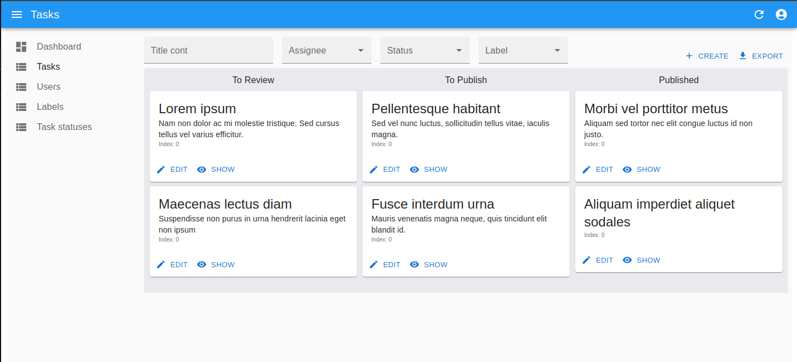

<h1>Task Manager</h1>

<p>Task Manager – task management system based on Spring.
It allows you to set tasks, assign executors and change their statuses.
Registration and authentication are required.</p>

<p>
<a href="https://github.com/zHd4/java-project-99/actions/workflows/main.yml"></a>
<a href="https://qlty.sh/gh/zHd4/projects/java-project-99"></a>
<a href="https://qlty.sh/gh/zHd4/projects/java-project-99"></a>
</p>



<h2>Quick start</h2>

<p>The following commands prepare and run Task Manager.</p>

```bash
mkdir src/main/resources/certs

# Generate RSA keys
openssl genrsa -out src/main/resources/certs/private.pem 2048
openssl rsa -in src/main/resources/certs/private.pem -outform PEM -pubout -out src/main/resources/certs/public.pem

# Build & run
./gradlew build
./gradlew bootRun
```

<p>After that you can access it on <a href="http://localhost:8080">localhost:8080</a> (use default credentials: admin@example.com:qwerty).</p>